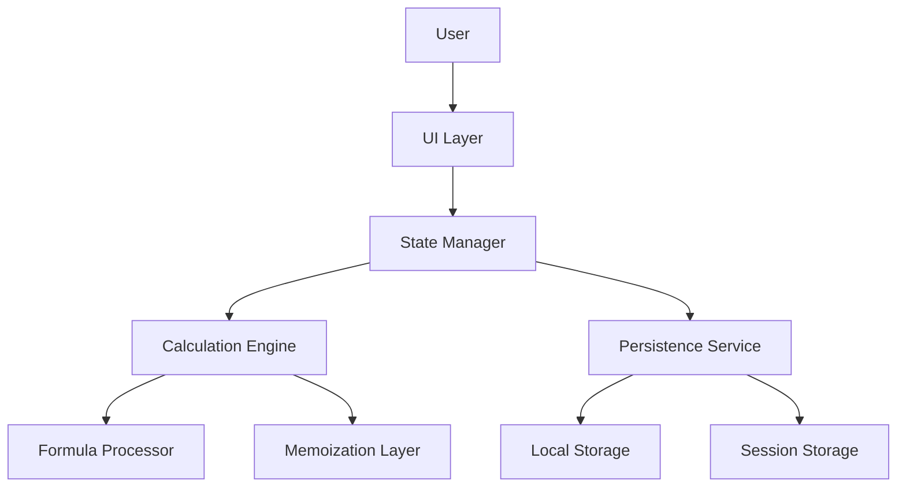

# Design Document for Damage Calculator Enhancement 伤害计算器增强设计文档

## Overview 概述

This design document outlines the technical approach for enhancing the existing damage calculator feature. The enhancements are organized into four key areas: functional extensions, interaction improvements, technical optimizations, and UI refinements. The design aims to create a more comprehensive, user-friendly, and efficient damage calculation experience while maintaining compatibility with the existing system architecture.

本设计文档概述了增强现有伤害计算器功能的技术方法。这些增强分为四个关键领域：功能扩展、交互改进、技术优化和UI改进。该设计旨在创建更全面、更友好、更高效的伤害计算体验，同时保持与现有系统架构的兼容性。

## Architecture 架构

The enhanced damage calculator will maintain the current client-side architecture while introducing new components and optimizations. The architecture will consist of:

增强型伤害计算器将保持当前的客户端架构，同时引入新的组件和优化。架构将包括：

1. **Core Calculation Engine 核心计算引擎**
   - Modular formula processor with plugin support for custom formulas
   - Memoization layer for performance optimization
   - Event-driven calculation pipeline

2. **State Management 状态管理**
   - Redux store for global state
   - Local component state for UI-specific interactions
   - Persistent storage for user presets and session data

3. **UI Components UI组件**
   - Responsive component library
   - Accessibility-enhanced input controls
   - Real-time visualization components

4. **Service Layer 服务层**
   - Preset management service
   - Offline calculation service
   - Performance monitoring service

### Architecture Diagram 架构图



## Components and Interfaces 组件和接口

### 1. Enhanced Calculation Engine 增强型计算引擎

The calculation engine will be extended to support more complex damage formulas and modifiers.

计算引擎将被扩展以支持更复杂的伤害公式和修饰符。

#### Key Interfaces 关键接口

```typescript
interface DamageModifier {
  id: string;
  name: string;
  description: string;
  apply: (baseDamage: number, context: CalculationContext) => number;
}

interface CustomFormula {
  id: string;
  name: string;
  formula: string;
  variables: Array<{name: string, description: string}>;
  calculate: (variables: Record<string, number>) => number;
}

interface CalculationContext {
  character: CharacterStats;
  equipment: EquipmentStats;
  environment: EnvironmentFactors;
  modifiers: DamageModifier[];
  customFormulas: CustomFormula[];
}
```

### 2. Preset Management System 预设管理系统

A new system for saving, loading, and managing calculation presets.

用于保存、加载和管理计算预设的新系统。

#### Key Interfaces 关键接口

```typescript
interface CalculationPreset {
  id: string;
  name: string;
  description: string;
  timestamp: number;
  context: CalculationContext;
}

interface PresetService {
  savePreset(preset: Omit<CalculationPreset, 'id' | 'timestamp'>): Promise<string>;
  loadPreset(id: string): Promise<CalculationPreset>;
  listPresets(): Promise<CalculationPreset[]>;
  deletePreset(id: string): Promise<void>;
}
```

### 3. Responsive UI Components 响应式UI组件

Enhanced UI components that provide immediate feedback and adapt to different devices.

提供即时反馈并适应不同设备的增强型UI组件。

#### Key Components 关键组件

- `DamageInputForm`: Handles user inputs with real-time validation
- `ResultsDisplay`: Shows calculation results with visual highlighting
- `PresetManager`: Interface for managing saved presets
- `MobileOptimizedControls`: Touch-friendly controls for mobile devices
- `AccessibilityWrapper`: Enhances components with accessibility features

### 4. Performance Optimization Layer 性能优化层

A layer dedicated to ensuring calculations are performed efficiently.

专门确保高效执行计算的层。

#### Key Interfaces 关键接口

```typescript
interface CalculationCache {
  get(key: string): number | null;
  set(key: string, value: number): void;
  invalidate(pattern?: string): void;
}

interface PerformanceMonitor {
  startMeasurement(id: string): void;
  endMeasurement(id: string): number;
  getMetrics(): PerformanceMetrics;
}
```

## Data Models 数据模型

### Character Stats Model 角色统计模型

```typescript
interface CharacterStats {
  baseAttack: number;
  critRate: number;
  critDamage: number;
  elementalMastery: number;
  level: number;
  talents: {
    normal: number;
    skill: number;
    burst: number;
  };
  constellation: number;
  elementalBonus: Record<ElementType, number>;
}
```

### Equipment Stats Model 装备统计模型

```typescript
interface EquipmentStats {
  weapon: {
    baseAttack: number;
    subStat: StatBonus;
    passiveEffect?: PassiveEffect;
    refinement: number;
  };
  artifacts: {
    flower: ArtifactStats;
    plume: ArtifactStats;
    sands: ArtifactStats;
    goblet: ArtifactStats;
    circlet: ArtifactStats;
    setEffects: SetEffect[];
  };
}

interface ArtifactStats {
  mainStat: StatBonus;
  subStats: StatBonus[];
}
```

### Calculation Result Model 计算结果模型

```typescript
interface DamageCalculationResult {
  baseDamage: number;
  critDamage: number;
  averageDamage: number;
  damageBreakdown: {
    base: number;
    critBonus: number;
    elementalBonus: number;
    reactionBonus: number;
    resistanceReduction: number;
    defenseReduction: number;
    otherBonuses: Record<string, number>;
  };
  equipmentContribution: Record<string, number>;
  timestamp: number;
}
```

## Error Handling 错误处理

### Input Validation 输入验证

- Client-side validation for all user inputs
- Descriptive error messages with suggestions for correction
- Visual indicators for invalid inputs
- Prevention of calculation with invalid inputs

### Calculation Error Handling 计算错误处理

- Try-catch blocks around calculation logic
- Fallback to simpler calculations when complex ones fail
- Logging of calculation errors for debugging
- User-friendly error messages for calculation failures

### Network and Storage Error Handling 网络和存储错误处理

- Offline mode detection and appropriate UI updates
- Retry mechanisms for failed storage operations
- Data integrity checks when loading presets
- Graceful degradation when storage is unavailable

## Testing Strategy 测试策略

### Unit Testing 单元测试

- Test each calculation function with various inputs
- Verify modifier application logic
- Test preset saving and loading
- Validate UI component behavior

### Integration Testing 集成测试

- Test the interaction between calculation engine and UI
- Verify state management with multiple operations
- Test preset system end-to-end
- Validate responsive behavior across breakpoints

### Performance Testing 性能测试

- Benchmark calculation speed with various complexity levels
- Test UI responsiveness during intensive calculations
- Measure memory usage during extended sessions
- Verify offline functionality

### Accessibility Testing 无障碍测试

- Screen reader compatibility testing
- Keyboard navigation testing
- Color contrast verification
- Focus management validation

## Design Decisions and Rationales 设计决策和理由

### 1. Client-Side Architecture 客户端架构

**Decision**: Maintain a primarily client-side architecture for calculations.

**决策**：保持主要的客户端架构进行计算。

**Rationale**: This approach minimizes latency for real-time calculations, supports offline functionality, and reduces server load. The calculations are not computationally intensive enough to warrant server-side processing.

**理由**：这种方法最大限度地减少了实时计算的延迟，支持离线功能，并减少了服务器负载。计算的计算强度不足以保证服务器端处理。

### 2. Modular Formula System 模块化公式系统

**Decision**: Implement a plugin-based system for damage formulas.

**决策**：为伤害公式实施基于插件的系统。

**Rationale**: This allows for easy extension with new formulas without modifying core code. Users can add custom formulas, and the system can be updated with new game mechanics as they are discovered.

**理由**：这允许轻松扩展新公式而无需修改核心代码。用户可以添加自定义公式，并且系统可以随着发现新的游戏机制而更新。

### 3. Memoization for Performance 使用记忆化提高性能

**Decision**: Implement memoization for calculation results.

**决策**：对计算结果实施记忆化。

**Rationale**: Many calculations will be repeated with the same inputs as users make small adjustments. Memoization significantly improves performance by caching results of expensive calculations.

**理由**：当用户进行小调整时，许多计算将使用相同的输入重复进行。通过缓存昂贵计算的结果，记忆化显著提高了性能。

### 4. Responsive Design with Mobile-First Approach 移动优先的响应式设计

**Decision**: Adopt a mobile-first design approach with responsive components.

**决策**：采用移动优先的设计方法和响应式组件。

**Rationale**: A significant portion of users access the calculator on mobile devices. This approach ensures a good experience across all devices while prioritizing the constraints of mobile interfaces.

**理由**：相当一部分用户在移动设备上访问计算器。这种方法确保了在所有设备上的良好体验，同时优先考虑移动界面的约束。

### 5. Local Storage for Presets 使用本地存储保存预设

**Decision**: Use browser local storage for saving calculation presets.

**决策**：使用浏览器本地存储保存计算预设。

**Rationale**: This provides persistence without requiring user accounts or server infrastructure. It's simple to implement and meets the requirement for saving and loading presets.

**理由**：这提供了持久性，而不需要用户帐户或服务器基础设施。它易于实现，并满足保存和加载预设的要求。

## Implementation Considerations 实施考虑

### Browser Compatibility 浏览器兼容性

The enhanced calculator will support:
- Chrome (latest 2 versions)
- Firefox (latest 2 versions)
- Safari (latest 2 versions)
- Edge (latest 2 versions)
- Mobile browsers (iOS Safari, Chrome for Android)

### Performance Targets 性能目标

- Initial load time: < 2 seconds
- Calculation time: < 500ms
- UI response time: < 100ms
- Memory usage: < 50MB

### Accessibility Compliance 无障碍合规性

The implementation will follow WCAG 2.1 AA standards, including:
- Proper semantic HTML
- ARIA attributes where necessary
- Keyboard navigation
- Color contrast ratios
- Screen reader compatibility

### Progressive Enhancement 渐进增强

The calculator will implement progressive enhancement to ensure core functionality works in all supported environments, with advanced features available in modern browsers.